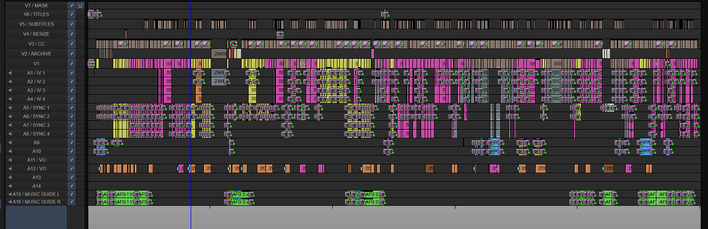
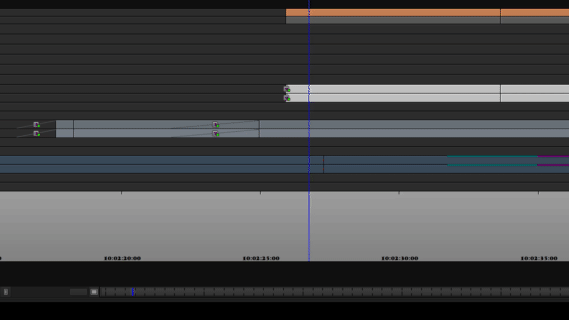
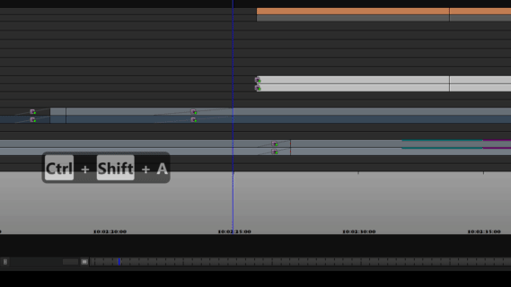
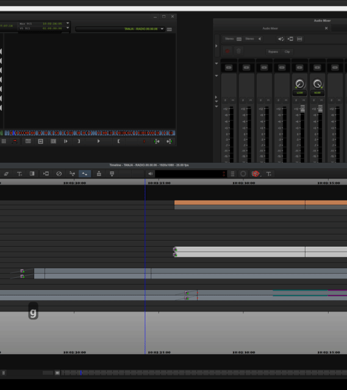

I'm trying to move from Avid Media Composer to Premiere Pro for a job. As I've been working on Avid for 20 years, this involves a bit of a shift to the muscle memory. 

I'm finding it in equal parts joyful and exasperating, butI don't mind the experiment as I'm finding I really do like some aspects of Premiere Pro. I especially love Extendscript as it opens some areas of automation - I only wish it could do more! I keep running into scenarios that simply aren't solvable through Extendscript. 

I'm very keyboard centric in the way I cut, and I like to be able to edit by moving the mouse as little as possible. If I can avoid lasso selecting things and moving anything with the mouse I definitely will. 

One action I can't get right in Premiere is adding audio fades and dissolves. I thought I could automate some of this with Extendscript, but CEP is hobbled when it comes to transitions. So I figured perhaps I'm just going about it in too Avid a way. Can someone help me find the right (meaning most keyboard efficient) solution to my day-to-day mixing activities on Premiere Pro?  

In Avid, I use audio transitions for Level Mixing and for Short audio transitions (softening hard audio edits). Here's a picture of a typical sequence in Avid for a fairly simple edit.

## Scenario 1 - Level Mixing

In Avid, I mix my sequences using clip Levels and placing dissolves (transitions) on through-edits. 

Imagine I have a bit of music on A9/10 (or a bit of sync on A1-4) that needs to dip, in Avid I add a through edit and go to the mixer to set the level after the cut. I move the cursor to where I want to start the level dip, fix the level in the mixer and click `Shift+3` which I've mapped to `Fade to cut`. 

I can slow down or speed up the fade in two simple operations: move the cursor to where I want the fade to start and click `Shift+3` to overwrite the existing fade with a new one. 

With my Razer Naga mouse, this is an incredibly swift and streamlined process. 

I can the positions of the mixes very quickly too. If I'm dipping for a bit of sync and I want to move the sync up a bit, I just go into trim mode (The `[` key on my keyboard) on A9 and A10 and move the match cut. 

So moving a dissolve 12 frames ealier is as simple as pressing: 

- `]` (Trim mode on selected tracks), 
- `-12` (move edit by -12 frames), 
- `Escape` (leave trim mode).

I know I've seen other editors use dissolves like this: I've seen their timelines. Personally, I use this method in preference to rubber banding for a few reasons: 

1) I like the accuracy of just being able to type numbers in to set levels on clips - it feels accurate, clean and mathematical. A bit too loud (-3), a lot too loud -14. 

2) I find it much faster to adjust the position of through-edits as things slip and move around a complex timeline.

3) it's very light when it comes to keypresses and doesn't require any fiddly mouse movements. 

4) I'm often not trying to get the perfect mix, but the best mix fastest to test my edit, and I can adjust complex sequences in a blind of an eye. 

## Scenario 2 - Short Transitions

I use short transitions to soften audio cuts in audio. Say I've got a cut between two bits of interview, but there's a short pop or a difference in background noise. 

In Avid, I select my sync tracks (say A1,2,7,8)  then I click `Shift+1` on my keyboard. This maps to `Add Quick Dissolve`. This brings up a dialog box with a duration in it, and the textbox with the duration is already selected, so I then tap keyboard `3`, or `5` or `10`, or wahtever to set the audio mix to the appropriate number of frames frames (the precise count depends on the precise sound difference I'm trying to soften). Assuming I've got the right tracks selected, this is 3 button clicks to get a dissolve on the four tracks: 

- `Shift+1`, `3`, `Enter`. Done!

If I haven't quite got the dissolve length right,  I just go through exactly the same process again with a different frame count and it overwrites the existing transitions: 

- `Shift+1`, `5`, `Enter`. 

With my mouse with a number pad (Razor Naga), I can do this without ever touching the keyboard. 

I also use this technique for dealing with starts of words which strictly lie between the frames. Sometimes I need to add a 1 frame edit to really get the start of the word.

Quick overview. It's fast, and very un-fiddly. 

## Potential Solutions

I thought I'd get up and running mixing in Premiere Pro quite quickly as I found the  `Apply Default Audio Transition To Playhead` command in the keybaord settings nad I mapped it to `Shift+3`. This looks like the right operation, but it's not. It works when you're fading tracks up or down to silence, but does not operate correctly when mixing between levels or between two different tracks. This command doesn't add a transition between two clips, but a fade to zero at the cut, and then a cut to the level at the cut.

The fastest way to add a real dissolve between two clips appears to be to select all the audio clips using the Lasso and press `Shift+Shift+D` to add a default audio dissolve. Then you have to multi-select the dissolves themselves (v fiddly) and double click them to change the dissolve length. What is an operation that I can achieve in less than a second in Avid takes 10 seconds in Premiere Pro. 

It's even fiddlier to adjust the offset of the transition (i.e. where it starts relative to the edit), especially where you might have multiple audio tracks. 

I thought I could just create an ExtendScript to pop up a dialog box and add custom transitions, but it doesn't appear there is a good way of interacting with transitions in Extendscript. 

## The Question

I'm beginning to think I'm fighting the system a bit, and I'm just not approaching my mix in the Premiere Pro way. I absolutely need to keep my mixing fast and flexible - it could cost me hours in an editing week.

Here's the challenge:

- For scenario 1: What is the fastest way of dipping audio for a continuous set of tracks. I need it in a way that means I can adjust the length and position of the dip as quickly as possible. And the levels on either side of the dip on multiple tracks as quickly as possible. 

- For scenario 2: In the shortest number of keystrokes possible, add a dissolve between (multiple tracks of) audio clips where the dissolve is N frames long. I would need this scenario for dissolves starting at the cut, ending at the cut, and centered on the cut. 

 